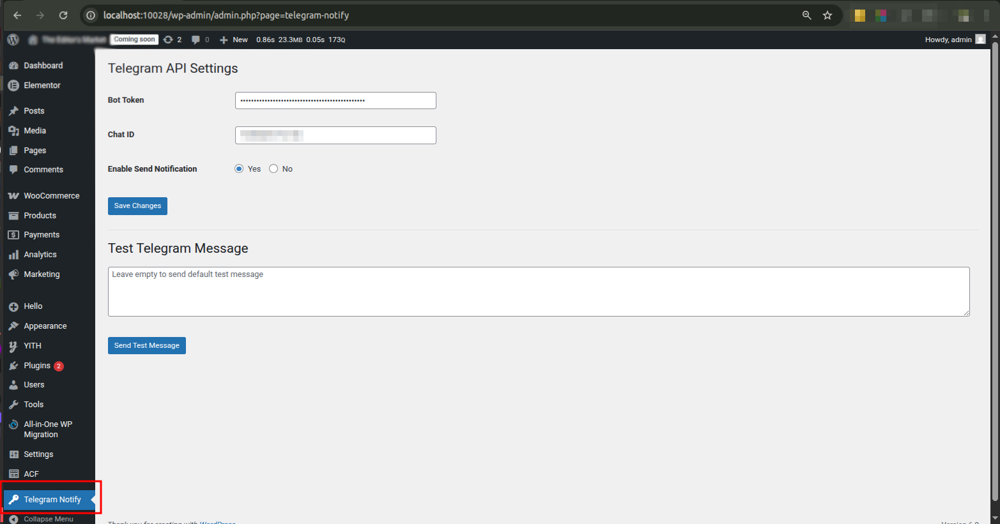
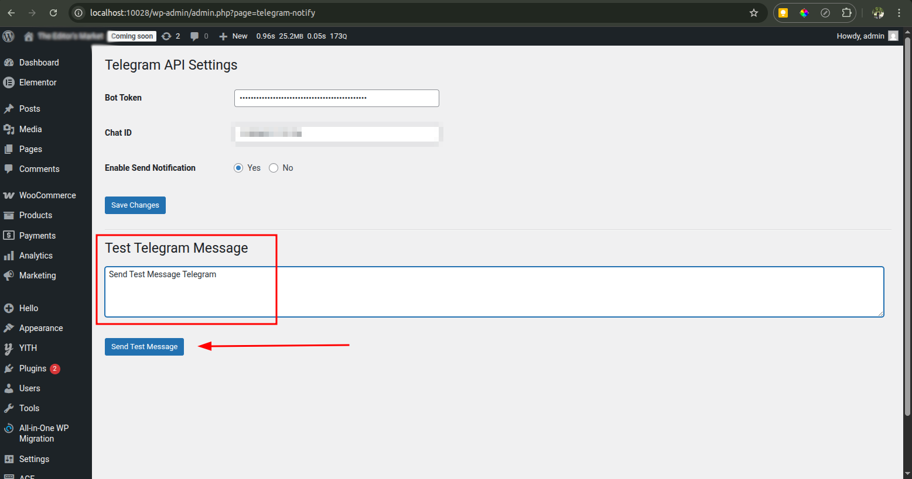
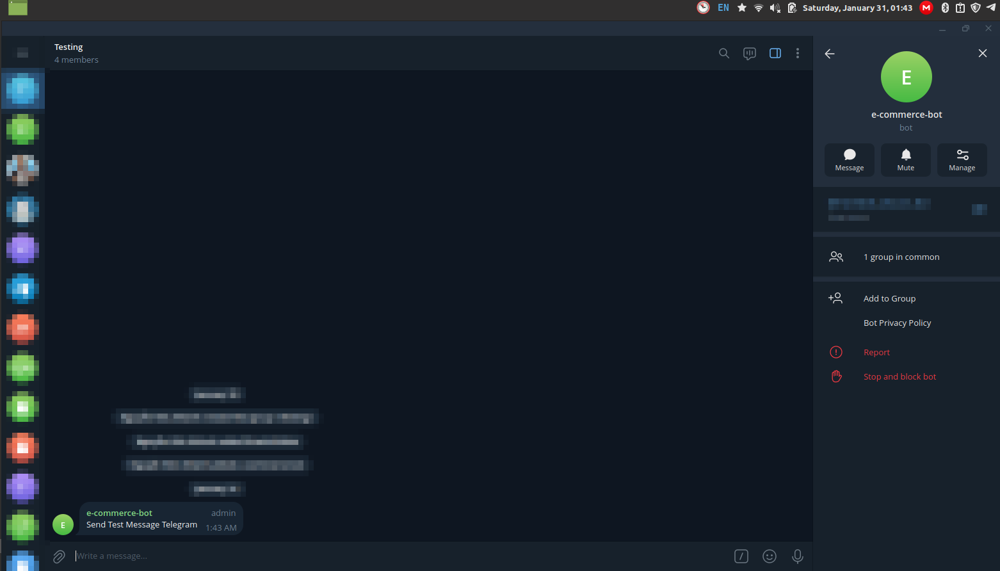

# Telegram Notification for WordPress

**Language:** English, Vietnamese

**Dependency:** PHP 8.1+

**Platform:** WordPress

**Author:** KhanhECB

**Release Date:** 2026-01-31

**Version:** 1.0.0


---

## Admin Page Demo



---

## Test Send Message



---

## Telegram Group Chat Example



---

## 🇻🇳 Giới thiệu

Đây là một plugin WordPress đơn giản dùng để gửi **Telegram notifications**, phù hợp cho các website doanh nghiệp, hệ thống quản trị nội bộ hoặc dự án WooCommerce.

### Tính năng chính

* **Admin Settings**

  * Cấu hình **Bot Token** và **Chat ID** trong trang Admin
  * Bật / tắt chức năng gửi thông báo Telegram
* **Gửi Test Message**

  * Gửi tin nhắn test trực tiếp từ Admin (bỏ qua trạng thái bật/tắt)
* **API Function đơn giản**

  * Cung cấp hàm API để sử dụng nhanh và gọn:

    ```php
    telegram_send( string $message );
    ```

### Gợi ý sử dụng

* **Tích hợp WooCommerce**

  * Hook vào sự kiện tạo đơn hàng mới
  * Gửi thông báo khi thay đổi trạng thái đơn hàng
* **Thông báo bảo mật**

  * Cảnh báo khi có nhiều lần đăng nhập thất bại
* **Thông báo Form Submit**

  * Gửi thông báo khi người dùng submit form
* **Ghi chú thủ công**

  * Gửi tin nhắn hoặc ghi chú vào nhóm chat Telegram thông qua chức năng Test Send

---

## 🇺🇸 Introduction

This is a simple WordPress plugin for sending **Telegram notifications**, suitable for company websites, internal systems, and WooCommerce-based projects.

### Main Features

* **Admin Settings**

  * Configure the **Bot Token** and **Chat ID** in the WordPress Admin panel
  * Enable or disable Telegram notifications
* **Send Test Message**

  * Send a test message directly from the admin page (bypasses the enable/disable setting)
* **Simple API Function**

  * Provides a lightweight API function for easy integration:

    ```php
    telegram_send( string $message );
    ```

### Suggested Use Cases

* **WooCommerce Integration**

  * Hook into WooCommerce order events to notify when a new order is created
  * Send notifications when an order status changes
* **Security Notifications**

  * Alert administrators when multiple failed login attempts occur
* **Form Submission Notifications**

  * Notify when a form is submitted
* **Manual Notes / Test Messages**

  * Send custom notes or messages to a Telegram group via the Test Send feature